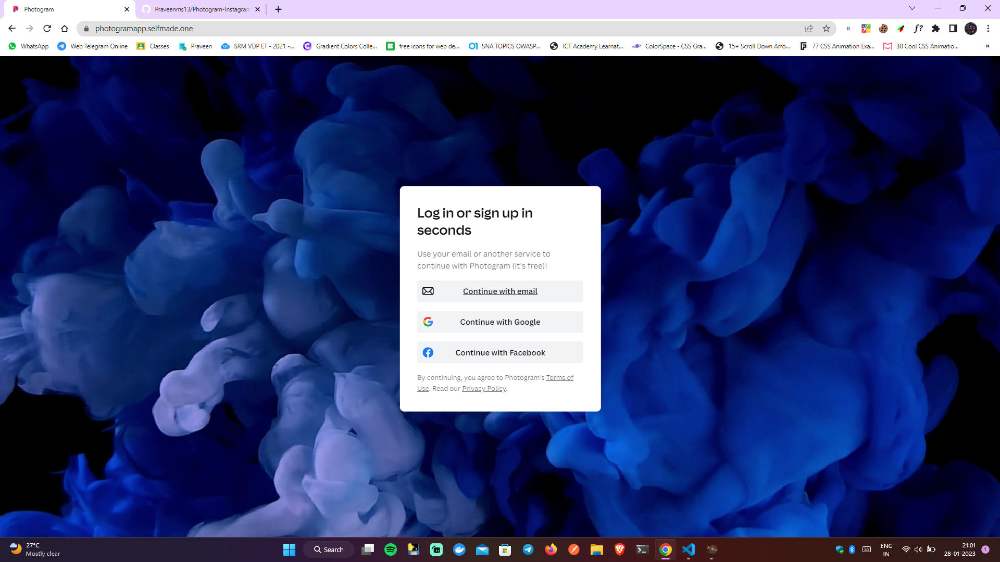

# Photogram - Social Media App - Under development 

## Appendix

Photogram is the online Social Media Platform which is like Pinterest. This Project's main source is Php and Javascript and Additional languages used are Html, Css, Jquery, Json, and python. The services used in this projects are Mysql, Mongodb, Reddis, RabitMQ. This Project Has Real Time Chatting Feature and Can post images and story like in instagram and much more features. The Project is still in development and will be completed and dockerized soon


## WebApp Link :  https://photogramapp.selfmade.one/

<hr>

## Screenshots : 




<hr>

## Languages Used

Languages used in this project are :

- html
- css
- Php
- Javascript, jquery, json
- python
<hr>

## Services Used

Services used in this project are :

- Mysql
- Mongodb
- Reddis
- RabitMQ

<hr>

## Tech Stack

**Client:** Bootstrap, TailwindCSS, Laravel

**Server:** Apache, Node
<hr>


## Deployed at

```javascript
https://photogramapp.selfmade.one/
```
